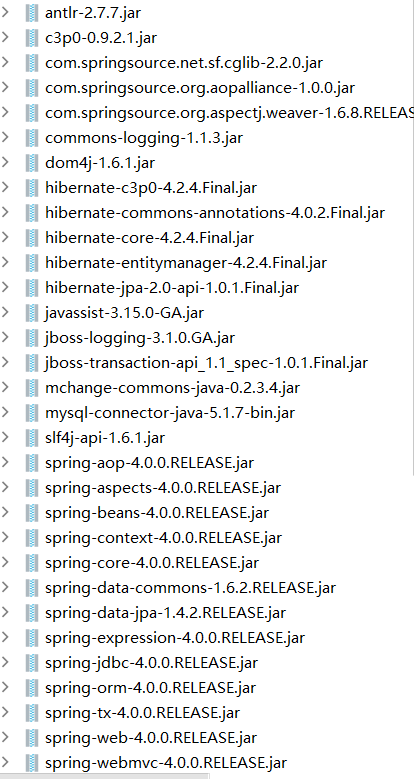
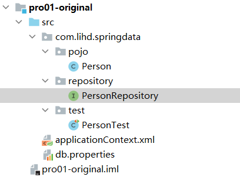
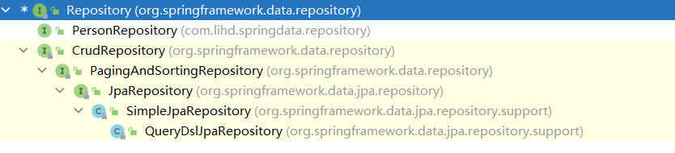
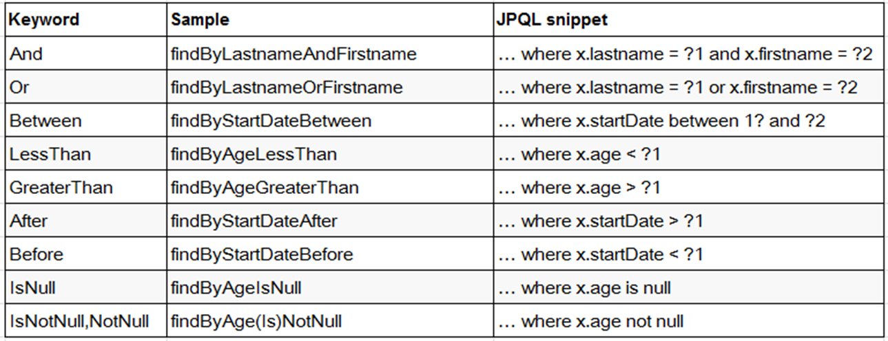
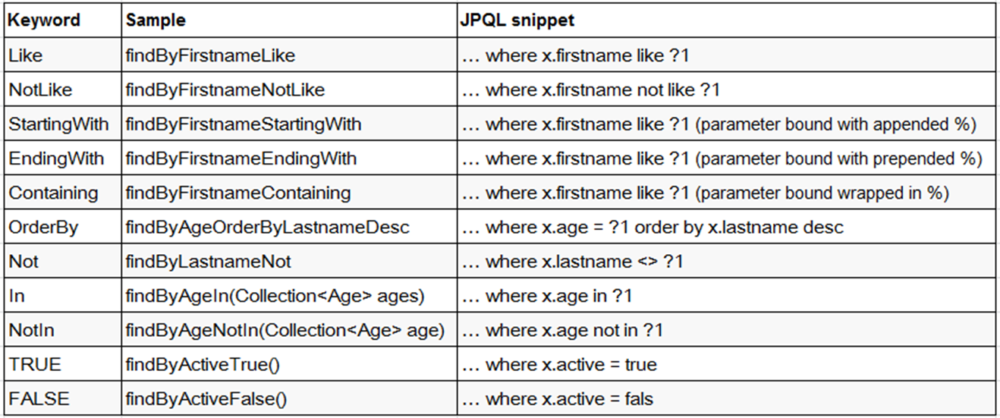
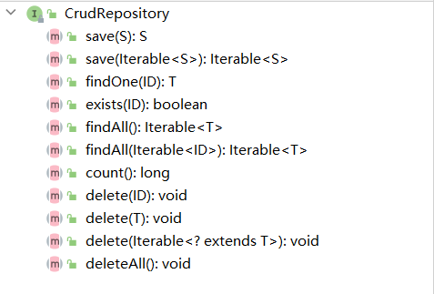

## SpringDataJpa
架构jar包 用到的技术比较老
视频可能是2017年录的 那个时候我才高一
现在已经大三了 但是一事无成 真的是感慨颇多啊

#### 1 概述

#### 2 SpringData hello world
##### 1 导入jar包 加入到项目工程 

##### 2 项目结构
其中 applicationContext.xml 和 db.properties放在 src下 

##### 3 db.properties
jdbc.user=root
jdbc.password=abc123
jdbc.driverClass=com.mysql.jdbc.Driver
jdbc.jdbcUrl=jdbc:mysql://localhost:13306/springdata
##### 4 applicationContext.xml
```xml
<?xml version="1.0" encoding="UTF-8"?>
<beans xmlns="http://www.springframework.org/schema/beans"
	xmlns:xsi="http://www.w3.org/2001/XMLSchema-instance"
	xmlns:context="http://www.springframework.org/schema/context"
	xmlns:tx="http://www.springframework.org/schema/tx"
	xmlns:jpa="http://www.springframework.org/schema/data/jpa"
	xsi:schemaLocation="http://www.springframework.org/schema/beans http://www.springframework.org/schema/beans/spring-beans.xsd
		http://www.springframework.org/schema/data/jpa http://www.springframework.org/schema/data/jpa/spring-jpa-1.3.xsd
		http://www.springframework.org/schema/tx http://www.springframework.org/schema/tx/spring-tx-4.0.xsd
		http://www.springframework.org/schema/context http://www.springframework.org/schema/context/spring-context-4.0.xsd">

	<!-- 配置自动扫描的包 -->
	<context:component-scan base-package="com.lihd.springdata"></context:component-scan>

	<!-- 1. 配置数据源 -->
	<context:property-placeholder location="classpath:db.properties"/>

	<bean id="dataSource"
		class="com.mchange.v2.c3p0.ComboPooledDataSource">
		<property name="user" value="${jdbc.user}"></property>
		<property name="password" value="${jdbc.password}"></property>	
		<property name="driverClass" value="${jdbc.driverClass}"></property>
		<property name="jdbcUrl" value="${jdbc.jdbcUrl}"></property>
		
		<!-- 配置其他属性 -->
	</bean>

	<!-- 2. 配置 JPA 的 EntityManagerFactory -->
	<bean id="entityManagerFactory" 
		class="org.springframework.orm.jpa.LocalContainerEntityManagerFactoryBean">
		<property name="dataSource" ref="dataSource"></property>
		<property name="jpaVendorAdapter">
			<bean class="org.springframework.orm.jpa.vendor.HibernateJpaVendorAdapter"></bean>
		</property>
		<property name="packagesToScan" value="com.lihd.springdata"></property>
		<property name="jpaProperties">
			<props>
				<!-- 二级缓存相关 -->
				<!--  
				<prop key="hibernate.cache.region.factory_class">org.hibernate.cache.ehcache.EhCacheRegionFactory</prop>
				<prop key="net.sf.ehcache.configurationResourceName">ehcache-hibernate.xml</prop>
				-->
				<!-- 生成的数据表的列的映射策略 -->
				<prop key="hibernate.ejb.naming_strategy">org.hibernate.cfg.ImprovedNamingStrategy</prop>
				<!-- hibernate 基本属性 -->
				<prop key="hibernate.dialect">org.hibernate.dialect.MySQL5InnoDBDialect</prop>
				<prop key="hibernate.show_sql">true</prop>
				<prop key="hibernate.format_sql">true</prop>
				<prop key="hibernate.hbm2ddl.auto">update</prop>
			</props>
		</property>
	</bean>

	<!-- 3. 配置事务管理器 -->
	<bean id="transactionManager"
		class="org.springframework.orm.jpa.JpaTransactionManager">
		<property name="entityManagerFactory" ref="entityManagerFactory"></property>	
	</bean>

	<!-- 4. 配置支持注解的事务 -->
	<tx:annotation-driven transaction-manager="transactionManager"/>

	<!-- 5. 配置 SpringData -->
	<!-- 加入  jpa 的命名空间 -->
	<!-- base-package: 扫描 Repository Bean 所在的 package -->
	<jpa:repositories base-package="com.lihd.springdata"
		entity-manager-factory-ref="entityManagerFactory"></jpa:repositories>

</beans>
```
##### 5 person
```java
@Entity
@Table(name = "t_person")
public class Person {

    private Integer id;
    private String name;
    private Integer age;
    private Date birthDay;

    @Id
    @GeneratedValue
    public Integer getId() {
        return id;
    }

    public void setId(Integer id) {
        this.id = id;
    }

    public String getName() {
        return name;
    }

    public void setName(String name) {
        this.name = name;
    }

    public Integer getAge() {
        return age;
    }

    public void setAge(Integer age) {
        this.age = age;
    }

    public Date getBirthDay() {
        return birthDay;
    }

    public void setBirthDay(Date birthDay) {
        this.birthDay = birthDay;
    }

    @Override
    public String toString() {
        return "Person{" +
                "id=" + id +
                ", name='" + name + '\'' +
                ", age=" + age +
                ", birthDay=" + birthDay +
                '}';
    }
}
```
##### 6 personRepository 接口
```java
public interface PersonRepository extends Repository<Person, Integer> {
    Person getByAge(Integer age);
}
```

##### 7 测试类
```java
public class PersonTest {
    private ClassPathXmlApplicationContext context;

    {
        context = new ClassPathXmlApplicationContext("applicationContext.xml");
    }

    /**
     * Test03 :
     */
    @Test
    public void test03 (){
        PersonRepository personRepository = context.getBean(PersonRepository.class);
        Person person = personRepository.getByAge(13);
        System.out.println(person);
    }

    /**
     * Test02 :
     */
    @Test
    public void test02 (){

    }

    @Test
    public void test01(){
        DataSource dataSource = context.getBean(DataSource.class);
        System.out.println(dataSource);
    }
}
```

##### 8 运行结果
真的能查出来 真的很强
```text
四月 28, 2022 9:07:52 上午 org.hibernate.tool.hbm2ddl.SchemaUpdate execute
INFO: HHH000232: Schema update complete
Hibernate: 
    select
        person0_.id as id1_0_,
        person0_.age as age2_0_,
        person0_.birth_day as birth_da3_0_,
        person0_.name as name4_0_ 
    from
        t_person person0_ 
    where
        person0_.age=?
Person{id=1, name='李太白', age=13, birthDay=2022-04-28 00:00:00.0}
```
#### 3 Repository接口
可以在定义中看到是一个空接口 是一个标识接口
```java
public interface Repository<T, ID extends Serializable> {

}
```
我们修改一下上节课的代码 这证明了这是一个Spring帮我们创建的一个代理类
System.out.println(personRepository.getClass().getName());
com.sun.proxy.$Proxy21 //结果

> 如果我们定义的接口继承了 Repository 这个接口会被IOC容器识别为一个RepositoryBean ，Spring会
> 创建器代理对象 纳入到IOC容器 ，进而我们可以在接口中定义满足规范的方法 

这个类的实现类

说明
```text
Repository： 仅仅是一个标识，表明任何继承它的均为仓库接口类
CrudRepository： 继承 Repository，实现了一组 CRUD 相关的方法
PagingAndSortingRepository： 继承 CrudRepository，实现了一组分页排序相关的方法
JpaRepository： 继承 PagingAndSortingRepository，实现一组 JPA 规范相关的方法
自定义的 XxxxRepository 需要继承 JpaRepository，这样的 XxxxRepository 接口就具备了通用的数据访问控制层的能力。
JpaSpecificationExecutor： 不属于Repository体系，实现一组 JPA Criteria 查询相关的方法
```

最后一点 继承Repository可以使用@RepositoryDefinition 代替 这和第二节中的代码是等效的
```java
@RepositoryDefinition(domainClass = Person.class,idClass = Integer.class)
public interface PersonRepository{

    Person getByAge(Integer age);
}
```
#### 4 方法命名规范

好处 ：名字就是方法作用 并且会根据名字创建方法
这会导致对名字要求很严格 注意写入参数 这导致我调错了两小时




亲测名字不能乱写 也一定要写上参数 
```text
* 在 Repository 子接口中声明方法
 * 1. 不是随便声明的. 而需要符合一定的规范
 * 2. 查询方法以 find | read | get 开头
 * 3. 涉及条件查询时，条件的属性用条件关键字连接
 * 4. 要注意的是：条件属性以首字母大写。
 * 5. 支持属性的级联查询. 若当前类有符合条件的属性, 则优先使用, 而不使用级联属性. 
 * 若需要使用级联属性, 则属性之间使用 _ 进行连接. 
```
```java
public interface PersonRepository extends Repository<Person,Integer>{

    Person getByAge(Integer age);

    //where age > ? and name like ?
    List<Person> getByAgeGreaterThanAndNameLike(Integer age,String name);

    //where name like %? and age <= ?
    List<Person> getByNameEndingWithAndAgeLessThanEqual(String name,Integer age);

    //where name in (?,?,..) and birth > ?
    List<Person> getByNameInOrBirthDayLessThan(List<String > names, Date birth);

    //    //where a.id > ?
    List<Person> getByAddressIdGreaterThan(Integer id);

    List<Person> getByAddress_IdGreaterThan(Integer id);
}
```

测试 注意测试类上面不要写注解（关于bean注册的注解 比如@Component）
```java
public class PersonRepositoryTest {
    private ClassPathXmlApplicationContext context;
    public PersonRepository personRepository;
    {
        context = new ClassPathXmlApplicationContext("applicationContext.xml");
        personRepository = context.getBean(PersonRepository.class);
    }


    @Test
    public void getByAge() {
        Person byAge = personRepository.getByAge(18);
        System.out.println(byAge);
    }

    @Test
    public void getByAgeGreaterThanAndNameLike() {
        List<Person> personList = personRepository.getByAgeGreaterThanAndNameLike(11, "%太%");
        System.out.println(personList);
    }

    @Test
    public void getByNameEndingWithAndAgeLessThanEqual() {
        List<Person> personList = personRepository.getByNameEndingWithAndAgeLessThanEqual("白", 18);
        System.out.println(personList);
    }

    @Test
    public void getByNameInAndBirthDayAfter() {
        ArrayList<String> list = new ArrayList<>();
        list.add("李太白");
        list.add("大白");

        List<Person> personList = personRepository.getByNameInOrBirthDayLessThan(list, new Date());
        System.out.println(personList);


    }

    @Test
    public void getByAddressIdGreaterThan() {
        List<Person> personList = personRepository.getByAddressIdGreaterThan(1);
        System.out.println(personList);
    }

    @Test
    public void getByAddress_IdGreaterThan() {
        List<Person> personList = personRepository.getByAddress_IdGreaterThan(1);
        System.out.println(personList);
    }
}
```

#### 5 @Query

```text
    //为 @Query 注解传递参数的方式1: 使用占位符. 

	//为 @Query 注解传递参数的方式1: 命名参数的方式. 

	//SpringData 允许在占位符上添加 %%. 
	
	//SpringData 允许在占位符上添加 %%. 
	
	//设置 nativeQuery=true 即可以使用原生的 SQL 查询
```
使用query注解 可以 实现子查询 也可以实现本地查询 也可以很方便实现模糊查询
```java
public interface PersonRepository extends Repository<Person,Integer>{
    
    @Query("select p from Person p where p.id = (select max(p2.id) from Person p2)")
    Person getMaxIdPerson();

    @Query("select p from Person p where p.name = ?1 and p.email = ?2")
    List<Person> testQueryAnnotationParam(String name,String email);

    @Query("select p from Person p where p.name = :name and p.email = :email")
    List<Person> testQueryAnnotationParam2(@Param("name") String name,@Param("email") String email);


    @Query("select p from Person p where p.name like %?1% and p.email like %?2%")
    List<Person> testQueryAnnotationLikeParam(String name,String email);

    @Query("select p from Person p where p.name like %:name% and p.email like %:email%")
    List<Person> testQueryAnnotationLikeParam2(@Param("name") String name,@Param("email") String email);


    @Query(value = "select count(*) from t_person",nativeQuery = true)
    Long testNativeQuery();
    

}
```

```java
public class PersonRepositoryTest {
    private ClassPathXmlApplicationContext context;
    public PersonRepository personRepository;
    {
        context = new ClassPathXmlApplicationContext("applicationContext.xml");
        personRepository = context.getBean(PersonRepository.class);
    }
    
    @Test
    public void getMaxIdPerson(){
        Person maxIdPerson = personRepository.getMaxIdPerson();
        System.out.println(maxIdPerson);
    }

    @Test
    public void testQueryAnnotationParam() {
        List<Person> 大白 = personRepository.testQueryAnnotationParam("大白", "654");
        System.out.println(大白);
    }

    @Test
    public void testQueryAnnotationParam2() {
        List<Person> 大白 = personRepository.testQueryAnnotationParam("大白", "654");
        System.out.println(大白);
    }

    @Test
    public void testQueryAnnotationLikeParam() {
        List<Person> personList = personRepository.testQueryAnnotationLikeParam("太", "2");
        System.out.println(personList);
    }

    @Test
    public void testQueryAnnotationLikeParam2() {
        List<Person> personList = personRepository.testQueryAnnotationLikeParam("太", "2");
        System.out.println(personList);
    }


    @Test
    public void testNativeQuery() {
        Long aLong = personRepository.testNativeQuery();
        System.out.println(aLong);
    }
}
```
#### 6 @Modifying注解

```text
//可以通过自定义的 JPQL 完成 UPDATE 和 DELETE 操作. 注意: JPQL 不支持使用 INSERT
//在 @Query 注解中编写 JPQL 语句, 但必须使用 @Modifying 进行修饰. 以通知 SpringData, 这是一个 UPDATE 或 DELETE 操作
//UPDATE 或 DELETE 操作需要使用事务, 此时需要定义 Service 层. 在 Service 层的方法上添加事务操作. 
//默认情况下, SpringData 的每个方法上有事务, 但都是一个只读事务. 他们不能完成修改操作!
```

personRepository中定义一个新的方法
```text
    @Modifying
    @Query("update Person p set p.name = :name where p.id = :id")
    void updateNameById(@Param("id") Integer id,@Param("name") String name);
```

测试
下面两个方法 
第一个报错 第二个正确执行
这是因为 ：DML方法需要事务支持
nested exception is javax.persistence.TransactionRequiredException
而第二个方法是service层中的， 这个service中方法标注了@Transactional

```text
    @Test
    public void updateNameById(){
        personRepository.updateNameById(3,"我就是太阳");
    }

    @Test
    public void updateNameById2(){
        personService.updateNameById(3,"我就是太阳");
    }
```
#### 7 Repository子接口CrudRepository
这是其中定义的方法 我们只测试批量插入
把之前的PersonRepository修改为
public interface PersonRepository extends CrudRepository<Person,Integer> {


personService
```java
@Service
@Transactional
public class PersonService {
    @Autowired
    private PersonRepository personRepository;

    @Transactional
    public void updateNameById(Integer id,String name){
        personRepository.updateNameById(id, name);
    }

    public void save(Iterable<? extends Person> iterable){

        personRepository.save(iterable);
    }
}
```
personTest
注意pageNum是从0开始的 因此我们要进行 +1  -1的处理
```java
public class MyTest{
 @Test
 public void testPagingAndSortingRepository(){

  int pageNum = 3 - 1;//pageNum从0开始
  int pageSize = 5;

  Pageable pageable = new PageRequest(pageNum,pageSize);
  Page<Person> page = personRepository.findAll(pageable);

  int totalPages = page.getTotalPages();
  long totalElements = page.getTotalElements();
  Sort pageSort = page.getSort();
  int size = page.getSize();
  int numberOfElements = page.getNumberOfElements();
  int number = page.getNumber() + 1;//上面-1 这里应该+1

  System.out.println("totalPages = " + totalPages);
  System.out.println("totalElements = " + totalElements);
  System.out.println("pageSort = " + pageSort);
  System.out.println("size = " + size);
  System.out.println("numberOfElements = " + numberOfElements);
  System.out.println("number = " + number);

  for (Person person : page.getContent()) {
   System.out.println(person);
  }

 }

 @Test
 public void testPagingAndSortingRepository2(){

  int pageNum = 3 - 1;
  int pageSize = 5;

  Sort.Order nameOrder = new Sort.Order(Sort.Direction.DESC, "name");
  Sort.Order ageOrder = new Sort.Order(Sort.Direction.ASC, "age");
  Sort sort = new Sort(nameOrder,ageOrder);

  Pageable pageable = new PageRequest(pageNum,pageSize,sort);
  Page<Person> page = personRepository.findAll(pageable);

  for (Person person : page.getContent()) {
   System.out.println(person);
  }
 }
}

```

```text
totalPages = 7
totalElements = 31
pageSort = null
size = 5
numberOfElements = 5
number = 3
Person{id=11, name='G220ceda1-', age=41, birthDay=2022-04-28 15:51:49.0}
Person{id=12, name='H653e8ca6-', age=42, birthDay=2022-04-28 15:51:49.0}
Person{id=13, name='I5482b52e-', age=43, birthDay=2022-04-28 15:51:49.0}
Person{id=14, name='J12718e9d-', age=44, birthDay=2022-04-28 15:51:49.0}
Person{id=15, name='Ka74e6a4b-', age=45, birthDay=2022-04-28 15:51:49.0}

进程已结束,退出代码0

```

```text
Hibernate: 
    select
        person0_.id as id1_1_,
        person0_.address_id as address_7_1_,
        person0_.add_id as add_id2_1_,
        person0_.age as age3_1_,
        person0_.birth_day as birth_da4_1_,
        person0_.email as email5_1_,
        person0_.name as name6_1_ 
    from
        t_person person0_ 
    order by
        person0_.name desc,
        person0_.age asc limit ?,
        ?
Person{id=23, name='Sff9ed3e8-', age=53, birthDay=2022-04-28 15:51:49.0}
Person{id=22, name='R746c1b03-', age=52, birthDay=2022-04-28 15:51:49.0}
Person{id=21, name='Q2f09b3b4-', age=51, birthDay=2022-04-28 15:51:49.0}
Person{id=20, name='P75ee602e-', age=50, birthDay=2022-04-28 15:51:49.0}
Person{id=19, name='Oc44cc302-', age=49, birthDay=2022-04-28 15:51:49.0}

进程已结束,退出代码0

```

#### 8 CrudRepository子接口PagingAndSortingRepository
有两个主要的方法 我们只看第二个
```java
@NoRepositoryBean
public interface PagingAndSortingRepository<T, ID extends Serializable> extends CrudRepository<T, ID> {

	Iterable<T> findAll(Sort sort);

	Page<T> findAll(Pageable pageable);
}
```
修改person的定义
public interface PersonRepository extends PagingAndSortingRepository<Person,Integer>


#### 9 PagingAndSortingRepository子接口JpaRespository
这个接口的定义
 我们只看 saveAndFlush()类似于之前的jpa的merge方法 
```java
@NoRepositoryBean
public interface JpaRepository<T, ID extends Serializable> extends PagingAndSortingRepository<T, ID> {
    List<T> findAll();

    List<T> findAll(Sort var1);

    List<T> findAll(Iterable<ID> var1);

    <S extends T> List<S> save(Iterable<S> var1);

    void flush();

    T saveAndFlush(T var1);

    void deleteInBatch(Iterable<T> var1);

    void deleteAllInBatch();
}
```

修改PersonRepository定义
public interface PersonRepository extends JpaRepository<Person,Integer> {

测试类
```text
    @Test
    public void testJpaRepository(){
        Person person = new Person();
        person.setName("jpa");
        person.setBirthDay(new Date());
        person.setAge(26);
        person.setEmail("JPA@SpringData");

        person.setId(30);

        Person person1 = personRepository.saveAndFlush(person);
        System.out.println(person1 == person);
    }
```
此时 注释了 person.setId(30) 的测试结果
```text
Hibernate: 
    insert 
    into
        t_person
        (address_id, add_id, age, birth_day, email, name) 
    values
        (?, ?, ?, ?, ?, ?)
true
```
这里没有注释 person.setId() 的测试结果
```text
Hibernate: 
    select
        person0_.id as id1_1_0_,
        person0_.address_id as address_7_1_0_,
        person0_.add_id as add_id2_1_0_,
        person0_.age as age3_1_0_,
        person0_.birth_day as birth_da4_1_0_,
        person0_.email as email5_1_0_,
        person0_.name as name6_1_0_ 
    from
        t_person person0_ 
    where
        person0_.id=?
Hibernate: 
    update
        t_person 
    set
        address_id=?,
        add_id=?,
        age=?,
        birth_day=?,
        email=?,
        name=? 
    where
        id=?
false
```
#### 10 独立的JpaSpecificationExecutor接口
之前的pagingAndSortingRepository不能实现有条件的分页 现在使用这个接口实现
```java
public interface JpaSpecificationExecutor<T> {
    
 T findOne(Specification<T> spec);

 List<T> findAll(Specification<T> spec);

 Page<T> findAll(Specification<T> spec, Pageable pageable);
 
 List<T> findAll(Specification<T> spec, Sort sort);


 long count(Specification<T> spec);
}
```
这个类定义如下
我们主要演示他的 page findall方法
将类修改为下面的形式
public interface PersonRepository extends JpaRepository<Person,Integer> , JpaSpecificationExecutor<Person> {

核心代码 这里的东西没学过 但是在hibernate好像讲过 
```text
Specification<Person> specification = new Specification<Person>() {
   /**
    * @param *root: 代表查询的实体类.
    * @param query: 可以从中可到 Root 对象, 即告知 JPA Criteria 查询要查询哪一个实体类. 还可以
    * 来添加查询条件, 还可以结合 EntityManager 对象得到最终查询的 TypedQuery 对象.
    * @param *cb: CriteriaBuilder 对象. 用于创建 Criteria 相关对象的工厂. 当然可以从中获取到 Predicate 对象
    * @return: *Predicate 类型, 代表一个查询条件.
    */
   @Override
   public Predicate toPredicate(Root<Person> root, CriteriaQuery<?> query, CriteriaBuilder cb) {
    Path id = root.get("id");

    Predicate predicate = cb.gt(id, 5);

    return predicate;
   }
  };
```

```java
public class MyTest{
 @Test
 public void testJpaSpecificationExecutor(){


  int pageNum = 3 - 1;
  int pageSize = 5;


  Sort.Order nameOrder = new Sort.Order(Sort.Direction.DESC, "name");
  Sort.Order ageOrder = new Sort.Order(Sort.Direction.ASC, "age");
  Sort sort = new Sort(nameOrder,ageOrder);

  PageRequest pageRequest = new PageRequest(pageNum,pageSize,sort);

  Specification<Person> specification = new Specification<Person>() {
   /**
    * @param *root: 代表查询的实体类.
    * @param query: 可以从中可到 Root 对象, 即告知 JPA Criteria 查询要查询哪一个实体类. 还可以
    * 来添加查询条件, 还可以结合 EntityManager 对象得到最终查询的 TypedQuery 对象.
    * @param *cb: CriteriaBuilder 对象. 用于创建 Criteria 相关对象的工厂. 当然可以从中获取到 Predicate 对象
    * @return: *Predicate 类型, 代表一个查询条件.
    */
   @Override
   public Predicate toPredicate(Root<Person> root, CriteriaQuery<?> query, CriteriaBuilder cb) {
    Path id = root.get("id");

    Predicate predicate = cb.gt(id, 5);

    return predicate;
   }
  };

  Page<Person> page = personRepository.findAll(specification, pageRequest);

  int totalPages = page.getTotalPages();
  long totalElements = page.getTotalElements();
  Sort pageSort = page.getSort();
  int size = page.getSize();
  int numberOfElements = page.getNumberOfElements();
  int number = page.getNumber() + 1;//上面-1 这里应该+1

  System.out.println("totalPages = " + totalPages);
  System.out.println("totalElements = " + totalElements);
  System.out.println("pageSort = " + pageSort);
  System.out.println("size = " + size);
  System.out.println("numberOfElements = " + numberOfElements);
  System.out.println("number = " + number);


  for (Person person : page.getContent()) {
   System.out.println(person);
  }
}
```
运行结果
```text
totalPages = 11
totalElements = 51
pageSort = name: DESC,age: ASC
size = 5
numberOfElements = 5
number = 3
Person{id=51, name='Tc4a6f78c-', age=54, birthDay=2022-04-28 19:15:41.0}
Person{id=24, name='T96b9419e-', age=54, birthDay=2022-04-28 15:51:49.0}
Person{id=23, name='Sff9ed3e8-', age=53, birthDay=2022-04-28 15:51:49.0}
Person{id=50, name='S05f4aab6-', age=53, birthDay=2022-04-28 19:15:41.0}
Person{id=49, name='R99b3767b-', age=52, birthDay=2022-04-28 19:15:41.0}

进程已结束,退出代码0
```


#### 11 自定义Repository方法

##### 为某一个Repository添加方法 
1 定义一个接口
```java
public interface PersonDAO {

    void getAPerson();
}

```
2 自定义的xxxRepository也实现这个接口
```java
public interface PersonRepository extends JpaRepository<Person,Integer> ,
        JpaSpecificationExecutor<Person> , PersonDAO {}

```
3 自定义一个类 名字必须是 xxxRepositoryImpl 实现这个接口
这其中的注解 注意PersistenceContext这个注解才能导入entityManager
有了这个entityManager就可以去使用jpa的部分了 
```java
@Repository
public class PersonRepositoryImpl implements PersonDAO {

    @PersistenceContext
    private EntityManager entityManager;

    @Override
    public void getAPerson() {
        Person person = entityManager.find(Person.class, 1);
        System.out.println("person = " + person);
    }
}
```
##### 为所有的Repository添加方法
```text
声明一个接口, 在该接口中声明需要自定义的方法, 且该接口需要继承 Spring Data 的 Repository.
提供 1) 所声明的接口的实现类. 且继承 SimpleJpaRepository, 并提供方法的实现
定义 JpaRepositoryFactoryBean 的实现类, 使其生成 1) 定义的接口实现类的对象
修改 <jpa:repositories /> 节点的 factory-class 属性指向 3) 的全类名
注意: 全局的扩展实现类不要用 Imp 作为后缀名, 或为全局扩展接口添加 @NoRepositoryBean 注解告知  Spring Data: Spring Data 不把其作为 Repository
```
尝试了一下 好麻烦 以后再说吧

尝试了 好久 但是还是失败了可恶


